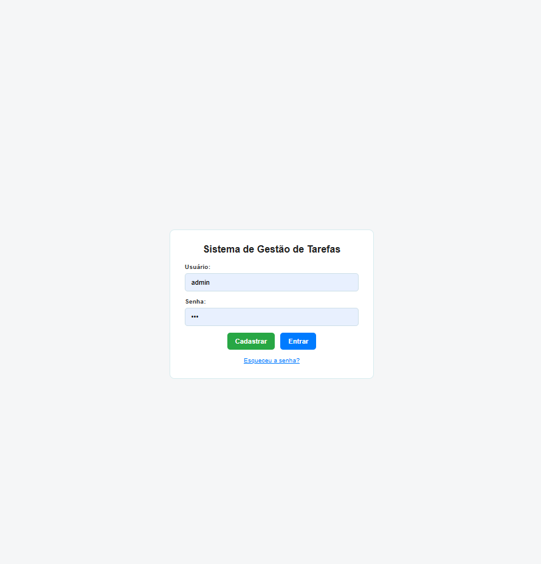
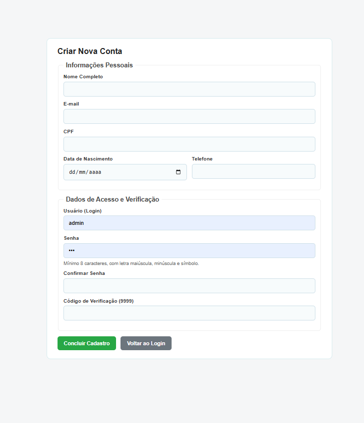
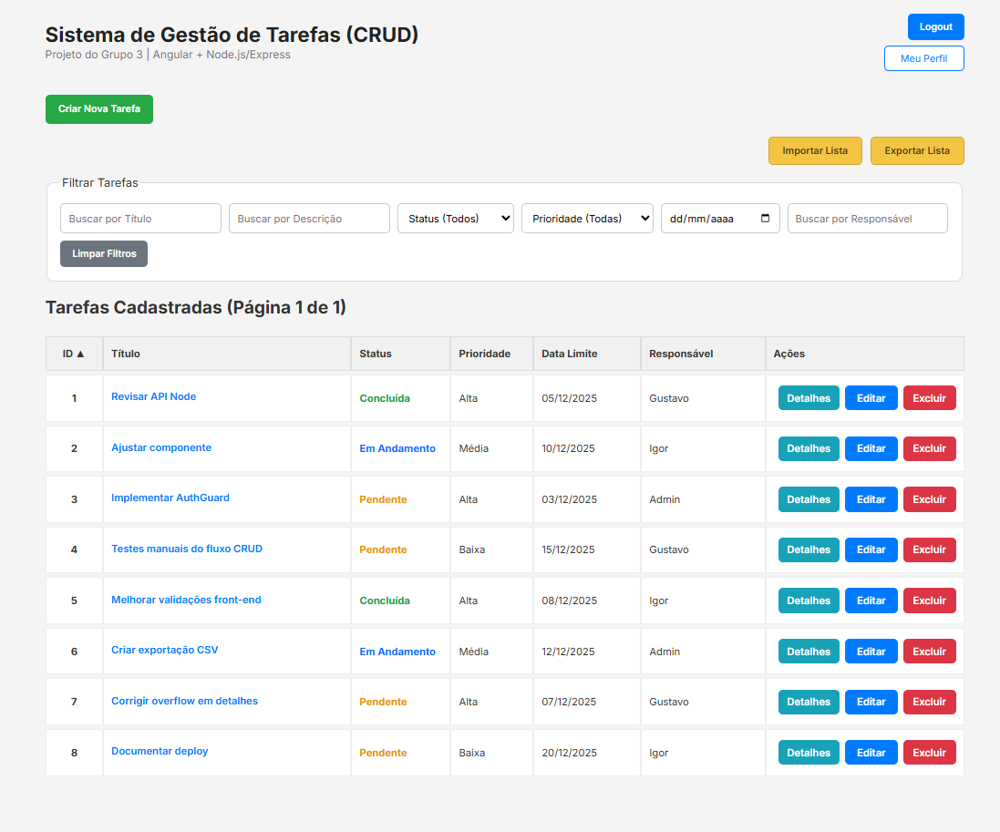
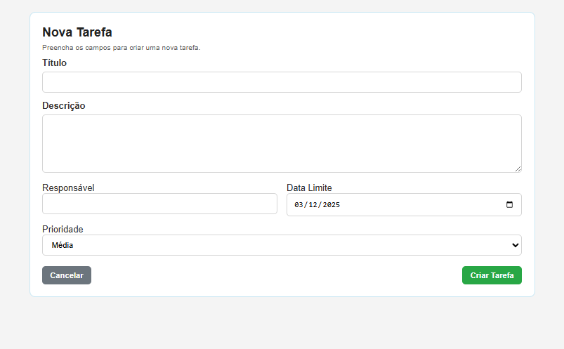
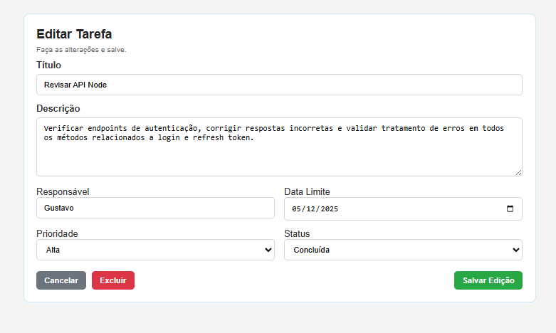
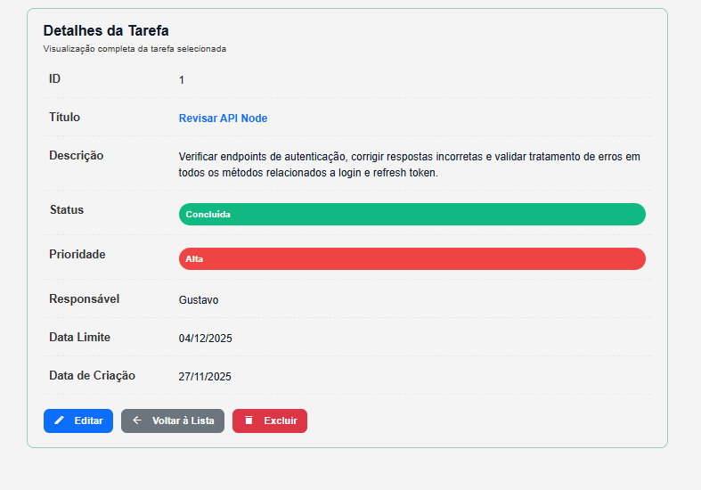
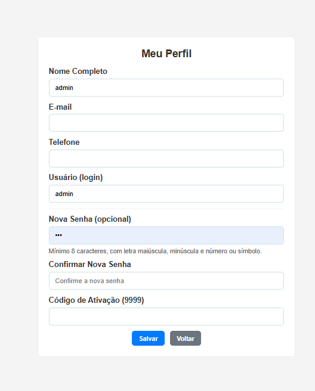
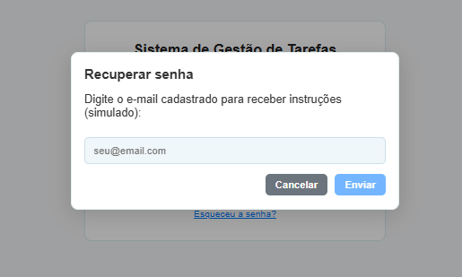
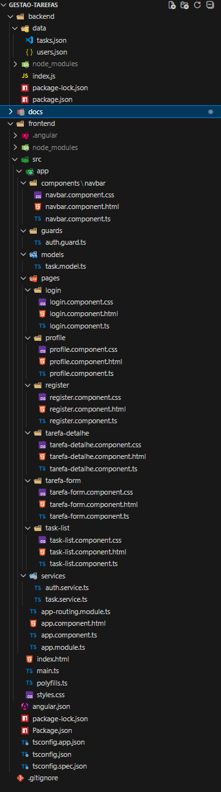

# Gestão de Tarefas – Angular + Node.js (Grupo 3) ONLINE

## Integrantes do Grupo
- **Gustavo Cerqueira Murai**
- **Igor Cerqueira Murai**

---

# 1. Introdução

Este projeto foi desenvolvido como parte do componente curricular de Programação Web.  
O objetivo consiste na criação de um sistema completo **CRUD (Create, Read, Update, Delete)** utilizando **Angular no frontend** e **Node.js + Express no backend**, conforme a proposta apresentada pelo professor.

A aplicação tem como propósito oferecer um ambiente intuitivo e funcional para **gestão de tarefas**, permitindo que o usuário registre, edite, exclua, consulte e filtre tarefas, além de manipular dados de perfil, autenticação e exportação/importação de dados.

---

# 2. Problema Escolhido pelo Grupo

Em ambientes organizacionais, acadêmicos ou pessoais, a ausência de ferramentas simples para acompanhar tarefas impacta diretamente a produtividade.  
O Grupo 3 escolheu desenvolver um **Sistema de Gestão de Tarefas** que permita:

- Registrar atividades com informações completas.  
- Acompanhar status, prioridade e prazos.  
- Facilitar o trabalho colaborativo por meio da organização visual das tarefas.  
- Garantir acesso seguro via autenticação.

O problema principal identificado foi a dificuldade em **controlar o andamento de atividades diárias**, especialmente quando existe grande volume de informações dispersas.

---

# 3. Objetivo do Projeto

O objetivo geral é **desenvolver uma solução Web funcional**, utilizando tecnologias modernas e acessíveis, contemplando:

- Interface clara via Angular.  
- Backend estruturado em Node.js/Express.  
- Persistência simples através de arquivos JSON.  
- Operações CRUD completas.  
- Aplicação modular, organizada e escalável.  
- Fluxo de autenticação, perfis e gerenciamento de usuários.

---

# 4. Tecnologias Utilizadas

## Frontend
- Angular 17  
- TypeScript  
- HTML5 / CSS3  
- HttpClient  
- Componentes e Services

## Backend
- Node.js  
- Express.js  
- File System (fs)  
- APIs REST

## Ferramentas
- VS Code  
- Git e GitHub  
- PowerShell / Terminal  

---

# 5. Arquitetura Geral do Sistema

```text
CLIENTE (Angular)
   |
   | HTTP
   |
SERVIDOR (Node.js + Express)
   |
   | FileSystem
   |
BASE DE DADOS (JSON Files)
```

---

# 6. Estrutura de Diretórios

```text
GESTAO-TAREFAS/
│
├── backend/
│   ├── data/
│   │   ├── tasks.json
│   │   └── users.json
│   │
│   ├── node_modules/
│   │   └── ... (arquivos internos)
│   │
│   ├── index.js
│   ├── package-lock.json
│   └── package.json
│
├── frontend/
│   ├── .angular/
│   │   └── ... (arquivos internos)
│   │
│   ├── node_modules/
│   │   └── ... (arquivos internos)
│   │
│   ├── src/
│   │   ├── app/
│   │   │   ├── components/
│   │   │   │   └── navbar/
│   │   │   │       ├── navbar.component.css
│   │   │   │       ├── navbar.component.html
│   │   │   │       └── navbar.component.ts
│   │   │   │
│   │   │   ├── guards/
│   │   │   │   └── auth.guard.ts
│   │   │   │
│   │   │   ├── models/
│   │   │   │   └── task.model.ts
│   │   │   │
│   │   │   ├── pages/
│   │   │   │   ├── login/
│   │   │   │   │   ├── login.component.css
│   │   │   │   │   ├── login.component.html
│   │   │   │   │   └── login.component.ts
│   │   │   │   │
│   │   │   │   ├── profile/
│   │   │   │   │   ├── profile.component.css
│   │   │   │   │   ├── profile.component.html
│   │   │   │   │   └── profile.component.ts
│   │   │   │   │
│   │   │   │   ├── register/
│   │   │   │   │   ├── register.component.css
│   │   │   │   │   ├── register.component.html
│   │   │   │   │   └── register.component.ts
│   │   │   │   │
│   │   │   │   ├── tarefa-detalhe/
│   │   │   │   │   ├── tarefa-detalhe.component.css
│   │   │   │   │   ├── tarefa-detalhe.component.html
│   │   │   │   │   └── tarefa-detalhe.component.ts
│   │   │   │   │
│   │   │   │   ├── tarefa-form/
│   │   │   │   │   ├── tarefa-form.component.css
│   │   │   │   │   ├── tarefa-form.component.html
│   │   │   │   │   └── tarefa-form.component.ts
│   │   │   │   │
│   │   │   │   └── task-list/
│   │   │   │       ├── task-list.component.css
│   │   │   │       ├── task-list.component.html
│   │   │   │       └── task-list.component.ts
│   │   │   │
│   │   │   └── services/
│   │   │       ├── auth.service.ts
│   │   │       └── task.service.ts
│   │   │
│   │   ├── app-routing.module.ts
│   │   ├── app.component.html
│   │   ├── app.component.ts
│   │   ├── app.module.ts
│   │   ├── index.html
│   │   ├── main.ts
│   │   ├── polyfills.ts
│   │   └── styles.css
│   │
│   ├── angular.json
│   ├── package-lock.json
│   ├── package.json
│   ├── tsconfig.app.json
│   ├── tsconfig.json
│   └── tsconfig.spec.json
│
├── docs/
│   ├── login.png
│   ├── cadastro.png
│   ├── lista-tarefas.png
│   ├── criar-tarefa.png
│   ├── editar-tarefa.png
│   ├── detalhes.png
│   ├── perfil.png
│   └── recuperar-senha.png
│
└── .gitignore

````
---

# 7. Guia de Instalação e Execução

## 7.1 Pré-requisitos

```
npm install -g @angular/cli
node --version
npm --version
```

---

## 7.2 Executando o Backend

```
cd backend
npm install
node index.js
```

Backend disponível em:

```
http://localhost:3000
```

---

## 7.3 Executando o Frontend

```
cd frontend
npm install
ng serve
```

Acesse:

```
http://localhost:4200
```

---

# 8. Descrição das Telas

## 8.1 Tela de Login  


## 8.2 Cadastro de Usuário  


## 8.3 Lista de Tarefas  


## 8.4 Criar Tarefa  


## 8.5 Editar Tarefa  


## 8.6 Detalhes  


## 8.7 Perfil  


## 8.8 Recuperar Senha  


## 8.9 Estrutura no VS Code


---

# 9. Descrição do Backend

- Node.js + Express  
- Rotas REST  
- Persistência em JSON  
- Autenticação simples  
- Estrutura modular para manutenção  

---

# 10. Descrição do Frontend

- Angular 17  
- Components e Services  
- Rotas protegidas com AuthGuard  
- HttpClient para comunicação  
- Formulários  
- Interface responsiva  

---

# 11. Conclusão

O projeto cumpre todos os requisitos do professor, entrega um CRUD completo, interface intuitiva, backend funcional e integração clara entre as camadas.

Demonstra domínio em Angular, Node.js e práticas modernas de desenvolvimento web.

---


